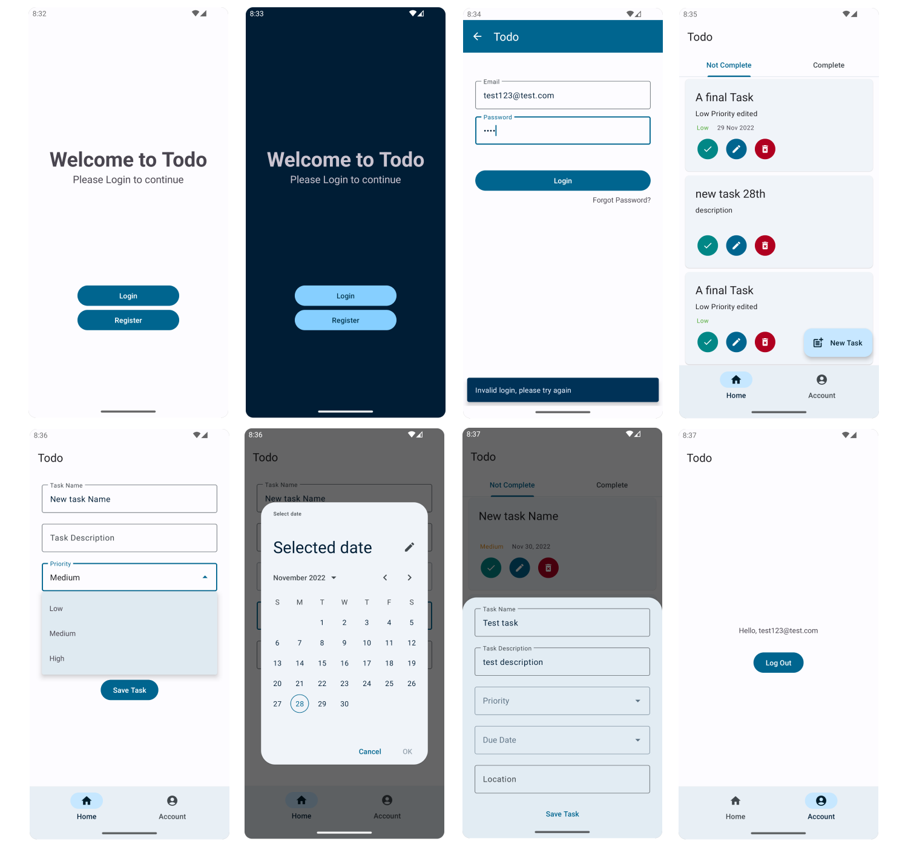

# Todo

Todo - a task management application built for Android

## Details

Todo is a basic task manager/todo list built for Android. It is built using Kotlin, MVVM / Clean Architecture, Fragments, Dagger & Hilt, with Firebase for the backend (Authentication & Firestore). The interface is built with Material 3 and uses the system preference to determine light/dark mode.

## Screenshots

## References

[Android Architecture Documentation](https://developer.android.com/topic/architecture)

[Firebase Documentation](https://firebase.google.com/docs/android/setup)

[Firebase with MVVM Playlist](https://www.youtube.com/playlist?list=PLIIWAqaTrNlg7q0cfajkBj8OwG60qpBVL)

[Material Design Components](https://m3.material.io/components)

[Material Design Theme Builder](https://m3.material.io/theme-builder)